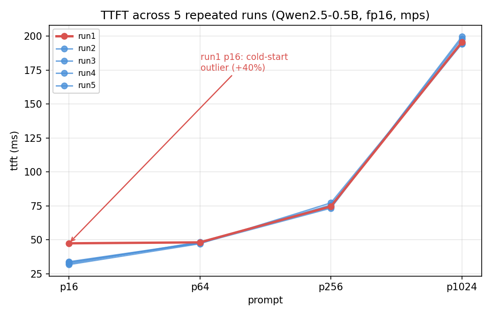

# HF Bench Notes

`hf_bench.py`로 측정하면서 나온 실측 관찰, 검증 실험 결과, 이상치 조사 기록.
숫자로 확인된 것만 남기고, 결정의 근거가 된 관찰은 날짜와 함께 남긴다.

---

## Baseline variance (2026-09-11)

**조건**: `model=Qwen/Qwen2.5-0.5B-Instruct dtype=fp16 device=mps sync=True warmup=True gen_tokens=128`
같은 프로세스를 5번 독립적으로 재실행 (매번 모델 재로드, 워밍업 1회씩).



| prompt | ttft_ms (run2–5) | decode_tok_s (5회 전체) | peak_rss_gb |
|---|---|---|---|
| p16 | 31.7 – 33.8 | 51.6 – 53.9 | 2.15 (5회 동일) |
| p64 | 47.1 – 48.4 | 56.6 – 57.8 | 2.15 |
| p256 | 73.3 – 77.2 | 51.4 – 52.8 | 2.15 |
| p1024 | 194.4 – 199.7 | 49.4 – 50.5 | 2.15 |

**정상 변동폭**: ttft_ms, decode_tok_s 모두 ±1~3% 수준. `peak_rss_gb`는 5회 전부 완전히 고정.

**예외 — run1의 p16 TTFT만 47.4ms로 이탈** (나머지 4회는 31.7~33.8ms, 그래프에서 빨간 선). run2~5는 각각 독립된
프로세스인데도 이 튐이 재현되지 않았으므로, `hf_bench.py`의 워밍업 로직 문제가 아니라
세션 전체에서 최초 1회에만 발생하는 콜드스타트(디스크 페이지 캐시 또는 OS 전력 상태)로 판단.

**결론 — 1-3 검증 실험 설계에 반영**:
- `sync`/`warmup` 대조 실험에서 각 조건당 최소 1회는 버림 실행으로 두고, 그 이후 값으로 비교한다.
- 관찰된 차이가 이 기준(±1~3%)보다 작으면 잡음과 구분 불가로 판단하고, 그보다 크면 유의미한
  효과로 본다.

### 계산식 역산 검증

`decode_tok_s = (gen_tokens - 1) / (total_s - ttft_s)`가 실제 로그 값과 일치하는지
`total_s`, `ttft_ms`, `gen_tokens=128`로 역산하여 20개 조합(5회 × 4프롬프트) 전체 대조.

```
decode_recalc = 127 / (total_s - ttft_ms/1000)
implied_gen   = round(decode_logged * (total_s - ttft_ms/1000)) + 1
```

결과: 20개 중 19개 완전 일치, 1개(run2/p64)는 로그에 표시된 소수점 자릿수(1자리) 반올림에
따른 0.16 오차로 실질적 불일치 아님. `implied_gen`은 20개 전부 정확히 128 — 요청한
`gen_tokens=128`이 실측에서도 그대로 지켜지고 있음을 교차 확인.

→ `decode_tok_s` 계산 로직이 설계한 정의(`run_one_prompt` 참고)대로 정확히 구현되어 있음을 확정.

---

## p64 / p256 TTFT 근접 이상 현상 — 재현 안 됨, 해소로 판단 (2026-09-11)

최초 단발 실행에서 `p64`(133.9ms)와 `p256`(149.3ms)의 TTFT가 토큰 수 4배 차이에 비해
지나치게 가깝게 나온 것이 관찰되어 조사 대상으로 표시해두었음.

이후 5회 반복 실행에서는 이 패턴이 **재현되지 않음** — `p64`(47.1–48.4ms)와
`p256`(73.3–77.2ms)이 프롬프트 길이에 비례해 정상적으로 벌어지는 패턴을 보임.

**판단**: 최초 관찰은 그 순간의 우연한 잡음(시스템 스케줄링 등)이었을 가능성이 높음.
코드 수정 불필요. 재조사 불필요.

---

## 1-3. 검증 실험 — 동기화(sync) / 워밍업(warmup) (2026-09-13)

**공통 조건**: `model=Qwen/Qwen2.5-0.5B-Instruct dtype=fp16 device=mps gen_tokens=128`

### 결론 요약

| 조건 | 판단 | 근거 |
|---|---|---|
| `--no-sync` | **효과 없음** | 3세션 전체가 `baseline`/`no_sync` 정상 범위(±1~3%) 안에 그대로 겹침 |
| `--no-warmup` | **효과 있음, TTFT 최대 +366~400%** | 매 세션 첫 프롬프트(`p16`)가 33~36ms → 148~183ms로 일관되게 튐 |
| `--no-warmup` 부가 현상 | **2차 프롬프트 오염이 간헐적으로 3차까지 이어짐** | 정상 프로세스 정리 후에도 완전히 사라지지 않음 (아래 상세) |

### ① 동기화(sync) — 효과 없음

`no_sync` 3세션(`p16/p64/p256/p1024` 전부)이 `baseline`/`no_sync`의 정상 변동폭(±1~3%) 안에 그대로 들어옴. `torch.mps.synchronize()`를 명시적으로 호출하든 안 하든 측정값에 유의미한 차이 없음.

**추정 원인** (확정 아님): `model.generate()`의 자기회귀 루프는 매 스텝마다 다음 토큰을 뽑기 위해 로짓을 CPU로 가져오는 연산이 필연적으로 들어가고, 이 자체가 암묵적으로 GPU-CPU를 동기화시키는 지점이 되어 명시적 `synchronize()`가 불필요해진 것으로 보임.

### ② 워밍업(warmup) — 효과 있음, TTFT 급증

`no_warmup` 첫 프롬프트(`p16`) TTFT가 베이스라인(33~36ms) 대비 **+340~400%** 수준(148~183ms)으로 모든 세션에서 일관되게 재현됨 — 콜드스타트의 우연적 튐(이전 관찰 +40%)과는 규모가 다른, 결정론적 현상.

### ③ 2차 프롬프트(`p64`) 오염 — 빈도와 지속 범위

`p64` ttft가 정상 범위(47~51ms)를 벗어나는 "오염" 발생 빈도:

| 실험 배치 | 오염 세션 수 | 비고 |
|---|---|---|
| 1차 (환경 통제 안 함, 6세션) | 3/6 (50%) | `c2bcd99c`는 peak_rss_gb 1.80GB로 급락한 심한 이상치(TTFT 375ms) 포함 |
| 2차 (`quiet_env`, 프로세스 정리 후, 6세션) | 1/6 (17%) | `a643a368`, peak_rss_gb는 정상 |

**프로세스 정리가 발생 빈도를 낮추지만(50%→17%) 완전히 없애지는 못함.**

**오염이 발생하면 3차 프롬프트(`p256`)까지 이어짐** — `p64`가 튄 세션(`8b05eefa`, `a643a368`)에서 `p256`의 `decode_tok_s`도 함께 낮게 나옴 (동일 세션 내 연쇄, 별개의 새 현상 아님). 두 차례(6세션+6세션)에 걸쳐 같은 패턴이 재현되어 우연이 아닌 것으로 판단.

**두 가지 서로 다른 유형으로 추정**:

| 유형 | 사례 | 특징 |
|---|---|---|
| 심한 유형 | `c2bcd99c` | TTFT 극단적 급증(+2배), `peak_rss_gb` 동반 이상(정상 2.15GB → 1.80GB). 프로세스 정리로 재현 안 됨 → 외부 프로세스와의 메모리 경쟁으로 추정 |
| 약한 유형 | `8b05eefa`, `a643a368` | TTFT 중간 정도 상승(+30~40%), 메모리 지표는 정상. 프로세스 정리 후에도 재현됨 → 원인 미상 |

### 미해결 — 향후 조사 과제

약한 유형의 근본 원인은 확정하지 못함. MPS/Metal 드라이버의 산발적 지연, 또는 열 상태(코어 스로틀링) 등이 후보지만, 이를 구분하려면 `powermetrics` 등으로 CPU/GPU 온도·주파수를 함께 로깅해야 함 — 현재 하네스의 계측 범위를 벗어나므로 이번 프로젝트 범위에서는 더 파고들지 않고 한계로 명시함.

### 1-3 최종 결론

- `sync=True`는 유지할 근거가 약하나(측정 가능한 이득 없음), 제거해도 얻는 이득도 없으므로 기존 설계(항상 켜짐) 유지 — 코드 변경 불필요
- `warmup=True`는 필수 — 없으면 TTFT가 최대 4배 가까이 부풀려짐
- 워밍업을 켜도 드물게(6~17%) 콜드스타트 성격의 오염이 2~3번째 프롬프트까지 남을 수 있음 — 1-6 베이스라인 수집 시 이상치로 보이는 행이 나오면 이 현상을 먼저 의심하고, 필요시 해당 세션만 재실행으로 대체할 것